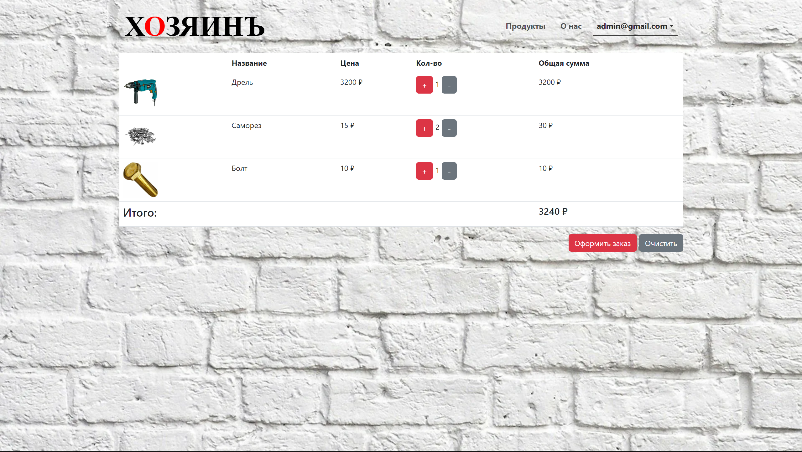
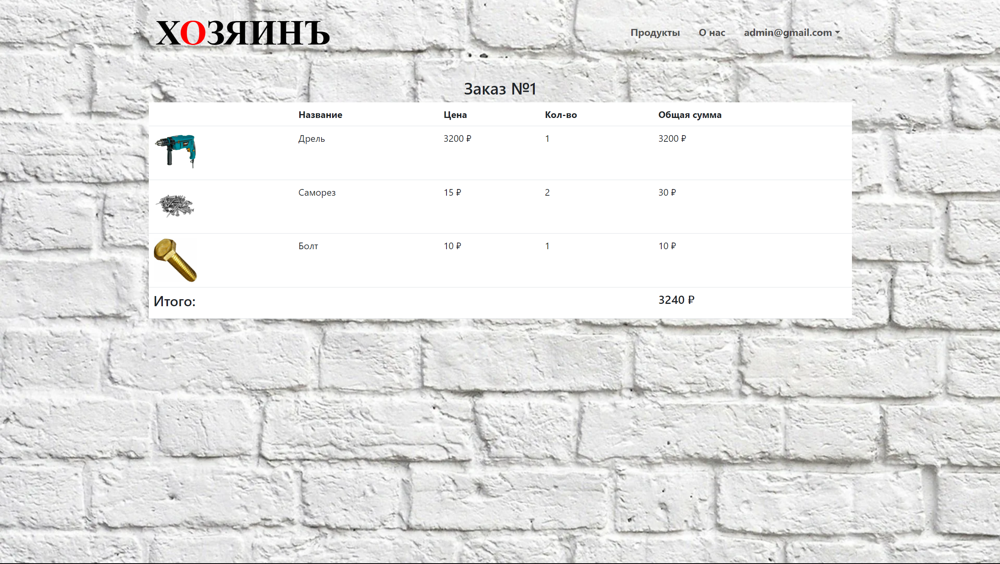

### **Проект**

Интернет-магазин строительных инструментов “Хозяинъ”

### **Цель**

* Разработать интернет-магазин “Хозяинъ”
* Магазин должен быть доступен в браузере через интернет
* Магазин должен предоставлять следующие возможности:
* Просмотр товаров
* Добавление товаров в корзину
* Оформление заказа
* Просмотр истории заказов
* Добавление товаров (только админы)

### **Технологии**

В проекте используются следующие технологии:

**SPA:**
* React
* JS

**REST API:**
* Java 17
* Spring boot
* Flyway
* Postgresql

### **Как запускается**
Сначала нужно запустить в модуле **backend** _BackendApplication_, 
а затем во **frontend** запустить скрипт _start_ в _package.json_

### **Возможности проекта**
При открытии страницы магазина, пользователь попадает на экран входа, 
где он может зайти в свой аккаунт либо перейти к регистрации

После авторизации пользователь может просматривать продукты, 
добавлять их в корзину, оформлять заказ и просматривать историю 
заказов. Админ также может создавать новые товары

